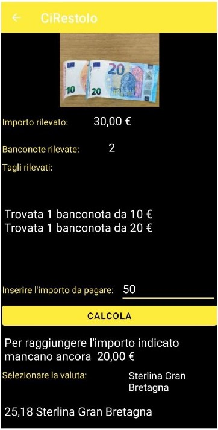
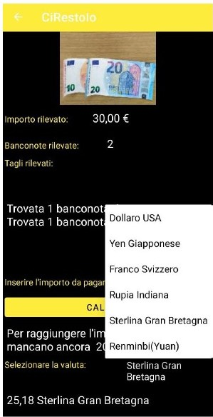

## Table of Contents
***
1. [General Info](#general-info)
2. [Technologies](#technologies)
3. [Model Training](#model-training)
4. [Contributors](#contributors)

### General Info

Android application which permits to take a photo and to identify Euro banknotes. The project was developed by three students during a project work at the University of Bologna.
The applications offers some operations after identifying banknotes in the photo:
* Calculate the total amount of cash displayed
* Show the banknotes recognized in the photo
* The user can insert an import and the app calculates the change or the difference to reach the amount displayed
* Converts the amount displayed in some differents currencies (Dollar, etc ... )

## Technologies

* DATASET : we build our custom dataset containing more than 1k euro banknote's photos from 5 euro to 100 euro.
* NEURAL NETWORK : For the identification of the banknotes we used [EfficientDetLite3](https://github.com/google/automl/tree/master/efficientdet) object detection model.

## Model Training

We used [TensorFlow Lite Model Maker](https://www.tensorflow.org/lite/guide/model_maker) to train the model on Google Colab. All the steps to train the model are showed in the link. 

## Contributors
* [Davide Filoni](https://github.com/DavideFiloni)
* [Fabio Scagliarini](https://github.com/fabioscaglia)
* [Filippo Comastri](https://github.com/FilippoComastri)

